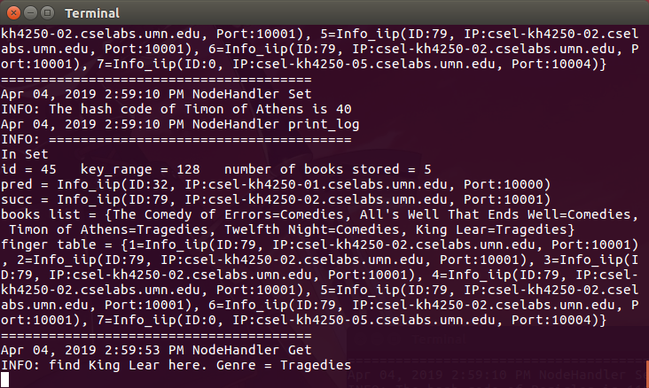

# Evaluation

## positive cases

For the usage of this project, you can refer to `README.md`. Here are some log 
information of Nodes, SuperNode, Client.

The first picture is the output of SuperNode. It will print log for three operations: 
`Join`, `PostJoin`, `GetNode`.

After a Node join the DHT, it will connect with other Nodes and update their information. 
When the information of a node is changed, it will print log of all information like below.

For the `Set` operation, the Client will first get a random Node from the SuperNode. And 
then it will connect this Node to Set the `Book_title` and `Genre`. If the Book belongs to 
the Node, it will store the Book in its own HashMap, otherwise, it will find the suitable 
Node for this Book. The `Get` operation is similar to `Set` operation. Here is a picture 
of the log of `Set` and `Get` operations in a Node.

Below is an instance of all input and output the Client.

## negative cases

The negative cases contains two parts: for Client and for Node.

For the Client, it might encounter this error: in the FILE command, the input filename is 
not exist. So, we try to check it before reading operation. Since the input file is at 
`ChordDemo/shakespeares.txt`, and the java classes is at `ChordDemo/classes`, we will add 
`../` for the filename. For instance, if you input `shakespeares.txt`, we will change it to 
`../shakespeares.txt`.

In the Join operation of the Node, if the SuperNode is busy with another Join 
(without received the PostJoin operation), it will return `"NACK"` to the Node. 
Below is the picture in busy Join (also, if the number of Nodes held by SuperNode 
is equal to the `key_range`, which is 128 in our example, the SuperNode will return "NACK").

